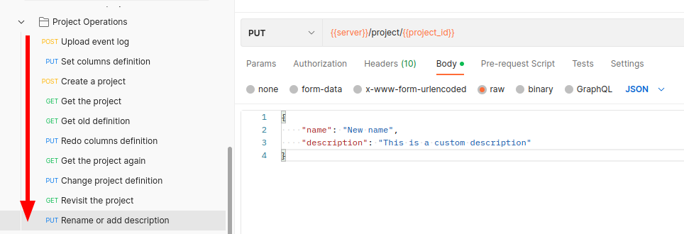

In order to test the API, users may utilize the latest version of the Postman collection, which can be found in the [Test with Postman](/getting-started/test-with-postman/) section.

After successfully creating a project, it is possible to track the status of said project by utilizing the `Get the project` request in the aforementioned collection.

Please follow the testing order shown in the figure, then you can observe the changes of the project's status.
