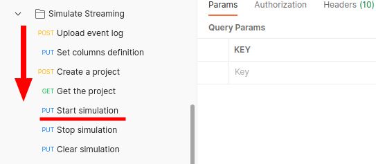

In order to test the API, users may utilize the latest version of the Postman collection, which can be found in the [Test with Postman]() section.

Once the project's status is `TRAINED`, you can simulate streaming data to the project.

Please follow the testing order shown in the figure, when you are in the stage `Start simulation`, you can turn to the [Get Prescriptions]() section to subscribe to the prescription results.
