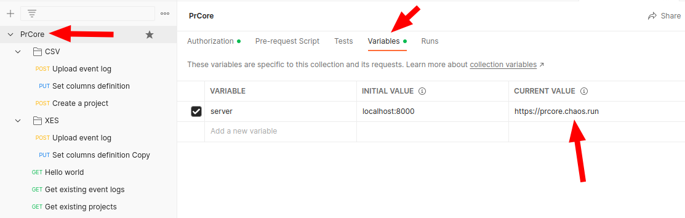
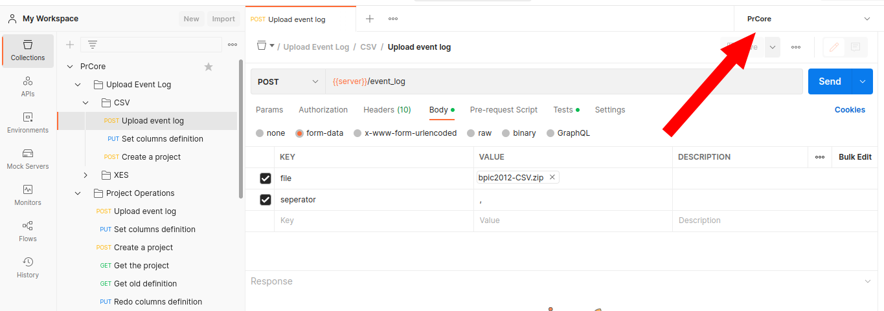

We provide a Postman collection to help you test the API. You can use the Postman collection to test the API without writing any code.

## Postman Collection

Following we will show you how to use the API by using the [Postman](https://www.postman.com/). Before you start, please make sure you have the following resources:

- [Postman](https://www.postman.com/) installed
- [Download the example collection](/download/postman_collection.json) and import it to Postman
- [Download the example environment](/download/postman_environment.json) and import it to Postman
- [Download the example event log file (CSV)](/download/bpic2012-CSV.zip) and [download the example event log file (XES)](/download/bpic2012-XES.zip), both are from BPI Challenge 2012

## Test the collection

After importing the collection and environment, you need to set the variables.

First, click the `PrCore` collection, and then click the `Variables` tab.

Then, set the `server` as `https://prcore.chaos.run`.

Also, when we using this collection, we need to set the environment to `PrCore`, which is the environment we imported before.

