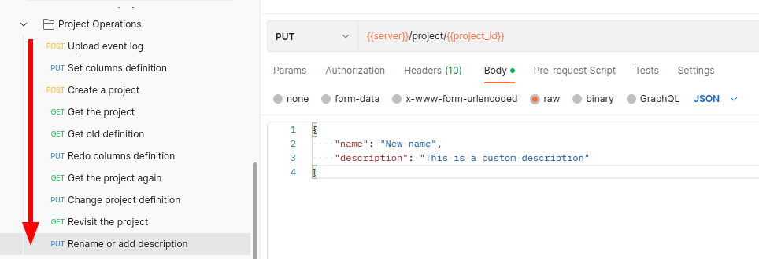

Here you can use the lastest version of the Postman collection to test the API, as [Getting Started](/usage/getting-started/#example-datasets) describes.

Once you have created a project, you can track the project's status by using the `Get the project` request in the collection.

Please follow the testing order shown in the figure, then you can observe the changes of the project's status.
