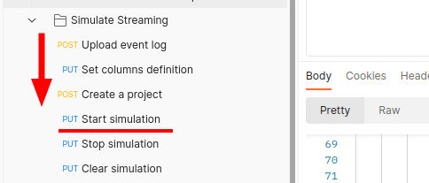

Here you can use the lastest version of the Postman collection to test the API, as [Getting Started](/usage/getting-started/#example-datasets) describes.

Once the project's status is `TRAINED`, you can simulate streaming data to the project.

Please follow the testing order shown in the figure, when you are in the stage `Start simulation`, you can turn to the [Get Prescriptions](/workflow/get-prescriptions/) section to subscribe to the prescription results.
