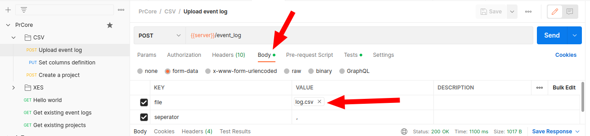

The examples in this section will show you how to use the API to upload event logs and create a new project.

## Upload event log

There is a request in the collection called `Upload event log`. This request will upload the event log file to the PrCore server, and the event log ID will be returned.

Navigate to the `Body` tab, select a file from the `file` field, and click `Send`. 


The file must be a CSV or XES file, or zip file containing one CSV or XES file. We recommend using the zip file, since it is much smaller and faster to upload.


## Submit column definitions

Another request in the collection called `Set columns definition`.

Navigate to the `Body` tab, modify the raw JSON data as you wish, and click `Send`.

## Submit outcome and treatment definitions to create a new project

The last main request in this example is `Create a project`.

Please note that we need to use the event log ID returned from the previous request, so you need to activate the environment `PrCore` you imported before, then the event log ID will be automatically handled in the request, without the need to manually enter it.

